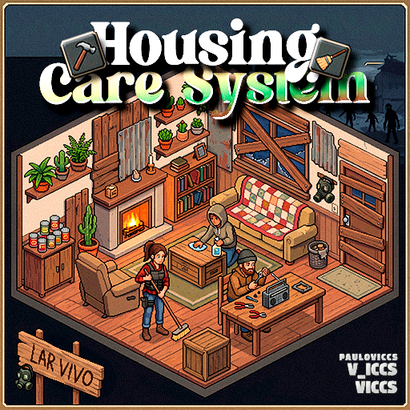
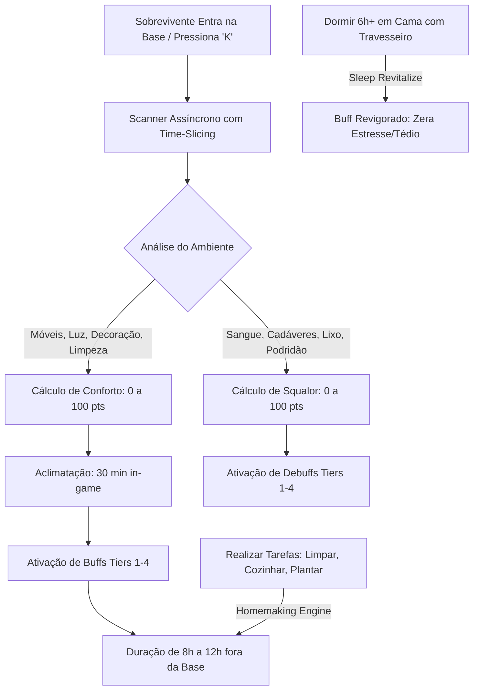

# 🧟‍♂️ VICCS — Project Zomboid Build 42 Mod Suite

[](https://projectzomboid.com/)
[](LICENSE)
[]()
[]()
[]()

---

> **Bem-vindo à suíte de modificações VICCS para o Project Zomboid (Build 42).**  
> Nossa filosofia de engenharia é direta: **Imersão profunda, arquitetura não-invasiva, zero impacto no FPS e 100% de estabilidade multiplayer.**

---

## 📑 Índice Geral

1. [🏛️ Catálogo de Módulos & Categorias](#-catálogo-de-módulos--categorias)
2. [🌟 Mod em Destaque: VICCS Housing Care System (Lar Vivo)](#-mod-em-destaque-viccs-housing-care-system-lar-vivo)
   - [O que é e Por que Existe? (ELI5)](#o-que-é-e-por-que-existe-eli5)
   - [Mecânicas Principais & Impacto na Gameplay](#mecânicas-principais--impacto-na-gameplay)
   - [Sistema de Conforto (Buffs)](#sistema-de-conforto-buffs)
   - [Sistema de Insalubridade / Squalor (Debuffs)](#sistema-de-insalubridade--squalor-debuffs)
   - [Motor de Vida Ativa & Tarefas Domésticas (Homemaking)](#motor-de-vida-ativa--tarefas-domésticas-homemaking)
   - [Sono Reparador & Travesseiros (Sleep Revitalize)](#sono-reparador--travesseiros-sleep-revitalize)
   - [Interface do Usuário & Controles (HUD Dinâmica)](#interface-do-usuário--controles-hud-dinâmica)
3. [🛠️ Guia para Donos de Servidores & Administradores](#️-guia-para-donos-de-servidores--administradores)
   - [Performance & Time-Slicing (Zero-Lag)](#performance--time-slicing-zero-lag)
   - [Integração com Safehouses (Multiplayer Dedicado)](#integração-com-safehouses-multiplayer-dedicado)
   - [Tabela Completa de Sandbox Options](#tabela-completa-de-sandbox-options)
   - [Compatibilidade Mid-Save](#compatibilidade-mid-save)
4. [📦 Instalação & Setup](#-instalação--setup)
5. [🌐 Localização & Suporte a Idiomas](#-localização--suporte-a-idiomas)
6. [🗺️ Roadmap de Futuros Módulos](#️-roadmap-de-futuros-módulos)

---

## 🏛️ Catálogo de Módulos & Categorias

Este repositório foi arquitetado para abrigar múltiplos mods modulares. Conheça as categorias oficiais da suíte:

| Categoria | Mod ID | Status | Descrição Curta |
| :--- | :--- | :---: | :--- |
| **🏠 Base Building & Imersão** | `VICCS_HousingCareSystem` | **Pronto / Estável** | Sistema orgânico de conforto, tarefas domésticas, higiene e sono reparador para lares. |
<!-- | **🎒 Sobrevivência & Inventário** | *Em breve* | 🔨 Planejamento | Módulos voltados para ergonomia de loot, organização de mochilas e preservação. |
| **🚗 Veículos & Manutenção** | *Em breve* | 🔨 Planejamento | Mecânicas avançadas de customização, desgaste e acampamento veicular. |
| **🧟 Combate & Sanidade** | *Em breve* | 🔨 Planejamento | Resposta psicológica ao combate prolongado, estresse pós-traumático e moral. |
| **⚙️ Utilitários de Servidor** | *Em breve* | 🔨 Planejamento | Ferramentas de telemetria, moderação e balanceamento de economia comunitária. | -->

---

## 🌟 Mod em Destaque: VICCS Housing Care System (Lar Vivo)

> **ID do Mod:** `VICCS_HousingCareSystem`  
> **Versão Suportada:** Project Zomboid **Build 42.0+** (42.20.x+)  
> **Dependências:** Nenhuma (100% Standalone)



### O que é e Por que Existe? (ELI5)

> 💡 **Analogia Simples:**  
> Imagine que você passou o dia inteiro fugindo de zumbis na chuva fria, carregando troncos pesados e sangrando.  
> - Se você volta para uma casa imunda, com poças de sangue no chão, cadáveres na sala e dorme no chão duro: **seu personagem vai enlouquecer de estresse, acordar cansado e ficar doente.**  
> - Mas se você volta para um lar limpo, com lareira acesa, paredes decoradas com quadros, tapetes, sofá macio e dorme em uma cama arrumada com travesseiro: **seu personagem descansa como um rei, acorda revigorado e ganha bônus de energia e cura acelerada.**

Inspirado na aclamada mecânica de conforto de jogos como *Valheim*, o **Housing Care System** transforma a construção e decoração de bases de uma atividade meramente cosmética em uma **vantagem tática vital de sobrevivência**.

---

### Mecânicas Principais & Impacto na Gameplay



---

### Sistema de Conforto (Buffs)

O mod avalia o ambiente e converte a pontuação acumulada (0 a 100) em **4 Tiers progressivos de Conforto**:

| Tier | Nome do Status | Pontos | Efeitos Ativos na Gameplay |
| :---: | :--- | :---: | :--- |
| **Tier 1** | 🌿 **Aconchego Básico** | `20+ pts` | Redução contínua de ganho de **Pânico** (-15%). |
| **Tier 2** | ☕ **Lar Organizado** | `40+ pts` | Redução de Pânico (-20%), **Regeneração Acelerada de Endurance** e redução de fadiga física (*Energizado*). |
| **Tier 3** | 🛋️ **Refúgio Confortável** | `60+ pts` | Redução drástica de **Infelicidade / Tristeza**, saciedade digestiva prolongada (*Saciado*) e **Cicatrização Acelerada** de arranhões e cortes. |
| **Tier 4** | 🏰 **Santuário** | `80+ pts` | **Imunidade a Pânico leve**, redução contínua de **Estresse**, regeneração rápida de feridas e resistência a infecções. |

#### 🛋️ O que soma pontos de conforto?
- **Descanso Essencial:** Camas de solteiro/casal (+25 pts), Sofás e Poltronas (+15 pts), Cadeiras (+10 pts).
- **Funcionalidade & Estudo:** Mesas e balcões (+15 pts), Estantes de livros, armários e cômodas (+15 pts).
- **Ambiente & Aconchego:** Lareiras, fogões e fornos (+12 pts), Tapetes e peles de animais (+12 pts), Quadros e pôsteres (+12 pts), Vasos de plantas (+10 pts).
- **Tecnologia & Cultura:** Rádios, TVs e telefones (+10 pts).
- **Iluminação Ativa:** Lâmpadas, velas e lareiras acesas (+15 pts).
- **Toque Artesanal:** Móveis construídos pelo próprio jogador via Carpintaria (+10 pts bônus).
- **Decoração 3D Orgânica:** Armas em suportes, livros, ferramentas e suprimentos organizados sobre mesas/prateleiras (+2 a +5 pts cada).

---

### Sistema de Insalubridade / Squalor (Debuffs)

Bases negligenciadas não apenas perdem bônus, como tornam o ambiente tóxico para a mente e corpo do sobrevivente:

| Tier | Nome do Status | Pontos | Efeitos Negativos |
| :---: | :--- | :---: | :--- |
| **Tier 1** | ⚠️ **Ambiente Desagradável** | `20+ pts` | Aumento leve e contínuo de **Infelicidade / Depressão**. |
| **Tier 2** | 🪰 **Ambiente Insalubre** | `40+ pts` | Acúmulo de **Estresse**, perda passiva de **Endurance** (cansaço rápido). |
| **Tier 3** | 🤢 **Antro Imundo** | `60+ pts` | **Náuseas frequentes**, tontura e fadiga mental constante. |
| **Tier 4** | ☠️ **Foco de Doença** | `80+ pts` | **Febre severa**, risco extremo de infecção em qualquer machucado. |

> 🚨 **A Regra de Precedência Crítica:**  
> Se o nível de sujeira/cadáveres ultrapassar o limite crítico (`Squalor >= 50`), **todos os bônus de conforto são instantaneamente anulados**, independentemente de quão luxuosa for a mobília.

---

### Motor de Vida Ativa & Tarefas Domésticas (Homemaking)

O mod recompensa o jogador por **manter a base ativa**. Ao realizar tarefas cotidianas dentro do seu abrigo, você estende a duração dos seus bônus de conforto em até **+8 horas diárias**:

* 🧹 **Limpeza do Lar:** Limpar manchas de sangue com água/alvejante ou recolher lixo do chão (**+15% de duração**).
* 🍳 **Culinária Caseira:** Preparar refeições elaboradas, sopas, assados e sanduíches no fogão (**+20% de duração**).
* 🌾 **Jardinagem & Agricultura:** Regar, plantar, adubar ou colher hortaliças (**+15% de duração**).
* 🔨 **Construção & Manutenção:** Serrar madeira, erguer paredes, portas, pintar ou barricar janelas (**+25% de duração**).
* 🖼️ **Decoração:** Posicionar móveis e organizar objetos decorativos (**+15% de duração**).

---

### Sono Reparador & Travesseiros (Sleep Revitalize)

Dormir bem no apocalipse agora faz toda a diferença:
1. **Dormir 6+ horas in-game** em uma cama ou sofá confortável.
2. **Ter um Travesseiro** (no inventário, equipado na mão ou colocado como objeto 3D sobre a cama).
3. **Resultado ao Acordar:**
   - **Zera 100% da Tristeza, Tédio e Estresse.**
   - Aplica o efeito **Revigorado** e renova a carga máxima de bônus do Lar por 8 horas.

---

### Interface do Usuário & Controles (HUD Dinâmica)

O mod inclui uma interface moderna, translúcida e de alto padrão estético:

* ⌨️ **Tecla de Atalho `K`:** Força uma varredura instantânea do ambiente e abre/fecha a HUD.
* 🖱️ **Painel Flutuante Drag & Drop:** Pode ser arrastado para qualquer lugar da tela com o mouse e lembra a posição.
* 📊 **Barra de Progresso Adaptativa:**
  - 🔵 **Azul:** Indicador de aclimatação enquanto o sobrevivente relaxa na base.
  - 🟢 **Verde:** Indicador de Conforto ativo, pontuação e tempo restante do buff.
  - 🟠 **Laranja/Vermelho:** Alerta de Insalubridade e contaminação por sujeira/cadáveres.
* 🏷️ **Moodles Nativos:** Totalmente integrado com a coluna lateral direita de moodlets do Project Zomboid com tooltips detalhados.

---

## 🛠️ Guia para Donos de Servidores & Administradores

Projetado do zero para servidores dedicados de grande porte (20 a 100+ jogadores simultâneos).

### Performance & Time-Slicing (Zero-Lag)

* **Varredura em Fatias de Tempo:** O scanner processa apenas `25 tiles por tick` no `Events.OnTick`. Isso elimina os micro-stutters clássicos de mods de base.
* **Amostragem Inteligente para Mansões:** Em Safehouses gigantes (>10 tiles de largura), o algoritmo aplica amostragem espacial com passo de 3 tiles, garantindo **78% de economia de CPU** com fidelidade de pontuação impecável.
* **Sem Monkey-Patching:** O código não substitui funções internas da VM Java/Kahlua. Zero risco de corrupção ou conflito com outros mods.

### Integração com Safehouses (Multiplayer Dedicado)

Por padrão, qualquer abrigo fechado ou cômodo com teto é avaliado. Para servidores competitivos ou RP:
* Configure `RequireSafehouseClaim = true` nas Sandbox Vars.
* Quando ativado, os buffs de conforto **só são concedidos a membros autorizados da Safehouse oficial**.

---

### Tabela Completa de Sandbox Options

Todas as opções podem ser configuradas no painel de Sandbox do jogo ou no arquivo `.ini` do servidor:

| Nome da Opção Sandbox | Tipo | Padrão | Intervalo | Descrição |
| :--- | :---: | :---: | :---: | :--- |
| `HousingCareSystem.SystemEnabled` | Bool | `true` | `true/false` | Ativa ou desativa todo o sistema globalmente. |
| `HousingCareSystem.AcclimatizationMinutes` | Int | `30` | `0 a 120` | Minutos in-game que o jogador deve permanecer na base para ativar os buffs. |
| `HousingCareSystem.ComfortCheckIntervalHours` | Int | `6` | `1 a 24` | Frequência de varreduras automáticas em segundo plano. |
| `HousingCareSystem.ComfortRadiusTiles` | Int | `15` | `5 a 40` | Raio máximo de tiles ao redor do jogador para cômodos sem tag oficial. |
| `HousingCareSystem.RequireRoofedRoom` | Bool | `true` | `true/false` | Exige teto/cômodo fechado para pontuar. |
| `HousingCareSystem.RequireSafehouseClaim` | Bool | `false` | `true/false` | Exige Safehouse oficial no multiplayer para liberar bônus. |
| `HousingCareSystem.Tier1Threshold` | Int | `20` | `10 a 50` | Pontuação mínima para Tier 1 (Aconchego). |
| `HousingCareSystem.Tier2Threshold` | Int | `40` | `20 a 70` | Pontuação mínima para Tier 2 (Organizado). |
| `HousingCareSystem.Tier3Threshold` | Int | `60` | `40 a 90` | Pontuação mínima para Tier 3 (Refúgio). |
| `HousingCareSystem.Tier4Threshold` | Int | `80` | `60 a 100` | Pontuação mínima para Tier 4 (Santuário). |
| `HousingCareSystem.BuffDurationBaseHours` | Double | `8.0` | `0.5 a 24.0` | Duração base do buff após sair da base. |
| `HousingCareSystem.BuffDurationMaxHours` | Double | `12.0` | `1.0 a 72.0` | Duração máxima absoluta permitida para buffs. |
| `HousingCareSystem.BuffMagnitudeMultiplier` | Double | `1.0` | `0.1 a 5.0` | Multiplicador de intensidade de todos os buffs positivos. |
| `HousingCareSystem.SqualorSystemEnabled` | Bool | `true` | `true/false` | Ativa/Desativa o sistema de insalubridade e debuffs. |
| `HousingCareSystem.SqualorOverrideThreshold`| Int | `50` | `10 a 90` | Ponto de sujeira que anula completamente os buffs de conforto. |
| `HousingCareSystem.HomemakingEnabled` | Bool | `true` | `true/false` | Ativa o bônus de duração por tarefas domésticas. |
| `HousingCareSystem.HomemakingMaxBonusHours` | Double | `8.0` | `1.0 a 48.0` | Teto diário de horas extras adquiridas trabalhando na base. |
| `HousingCareSystem.HomemakingCooldownSeconds`| Int | `45` | `5 a 300` | Cooldown anti-spam entre tarefas domésticas. |

---

### Compatibilidade Mid-Save

* ✅ **Adição Segura:** Pode ser adicionado a qualquer momento em mundos singleplayer ou servidores já em andamento.
* ✅ **Remoção Limpa:** Os dados são armazenados de forma transitória no `ModData` do jogador usando timestamps nativos (`getWorldAgeHours`). Se o mod for removido, o save continua funcionando sem erros.

---

## 📦 Instalação & Setup

### 👤 Singleplayer & Coop Local
1. Extraia ou clone a pasta `VICCS_HousingCareSystem` para o diretório de mods:  
   `C:\Users\<SeuUsuario>\Zomboid\mods\VICCS_HousingCareSystem`
2. No menu principal do jogo, clique em **Mods** e ative **Housing Care System (Lar Vivo)**.
3. Ao iniciar um novo jogo ou carregar um save, configure as opções de Sandbox desejadas.

### 🖥️ Servidor Dedicado
1. Adicione o Mod ID ao seu arquivo `server.ini`:
   ```ini
   Mods=VICCS_HousingCareSystem
   ```
2. Adicione as opções de Sandbox ao arquivo `server_SandboxVars.lua` ou utilize o painel de administração in-game.
3. Reinicie o servidor.

---

## 🌐 Localização & Suporte a Idiomas

O mod conta com tradução nativa e completa (textos de interface, moodlets, halo notes e opções de sandbox) para **5 idiomas**:

* 🇧🇷 **Português (Brasil)** — Nativo
* 🇺🇸 **Inglês (English)** — Nativo
* 🇪🇸 **Espanhol (Español)** — Nativo
* 🇨🇳 **Chinês Simplificado (简体中文)** — Nativo
* 🇹🇼 **Chinês Tradicional (繁體中文)** — Nativo

---

<!-- ## 🗺️ Roadmap de Futuros Módulos

Fique atento aos próximos lançamentos planejados para a suíte **VICCS**:

- [ ] **VICCS Advanced Cooking & Preservation:** Mecânica profunda de maturação de queijos, defumação de carnes e despensas frias subterrâneas.
- [ ] **VICCS Vehicle Living & Campers:** Adaptação do sistema de conforto para motorhomes, vans e acampamentos móveis.
- [ ] **VICCS Psychological Morale:** Sistema de sanidade e hobbies (leitura aprofundada, pintura, instrumentos musicais). -->

---

<div align="center">
  <sub>Desenvolvido com excelência técnica por <b>VICCS</b> para a comunidade global de Project Zomboid.</sub>
</div>
