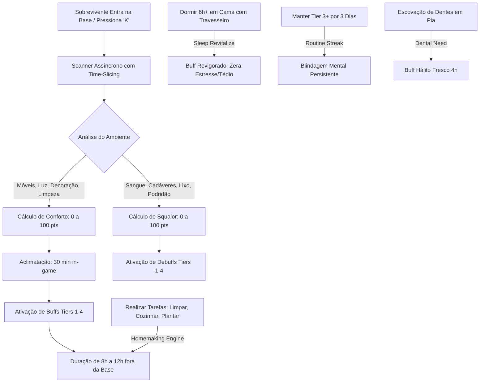

# 🧟‍♂️ VICCS — Project Zomboid Build 42 Mod Suite

[](https://projectzomboid.com/)
[](LICENSE)
[]()
[]()
[]()
[]()

---

> **Bem-vindo à suíte de modificações VICCS para o Project Zomboid (Build 42).**  
> Nossa filosofia de engenharia é direta: **Imersão profunda, arquitetura não-invasiva, zero impacto no FPS e 100% de estabilidade multiplayer.**

---

## 📑 Índice Geral

1. [🏛️ Catálogo de Módulos & Categorias](#-catálogo-de-módulos--categorias)
2. [🌟 Mod em Destaque: VICCS Housing Care System (Living House)](#-mod-em-destaque-viccs-housing-care-system-living-house)
   - [O que é e Por que Existe? (ELI5)](#o-que-é-e-por-que-existe-eli5)
   - [Mecânicas Principais & Impacto na Gameplay](#mecânicas-principais--impacto-na-gameplay)
   - [Sistema de Conforto (Buffs)](#sistema-de-conforto-buffs)
   - [Sistema de Insalubridade / Squalor (Debuffs)](#sistema-de-insalubridade--squalor-debuffs)
   - [Economia de Pontuação & Balanceamento (v1.5.8 Nerf)](#economia-de-pontuação--balanceamento-v158-nerf)
   - [Painel de Inspeção de Cômodo (Tecla K)](#painel-de-inspeção-de-cômodo-tecla-k)
   - [Sistema de Propriedade & Reivindicação de Base](#sistema-de-propriedade--reivindicação-de-base)
   - [Motor de Vida Ativa & Tarefas Domésticas (Homemaking)](#motor-de-vida-ativa--tarefas-domésticas-homemaking)
   - [Rotinas Táticas, Streaks & Casa Impecável](#rotinas-táticas-streaks--casa-impecável)
   - [Sazonalidade Tática (Inverno & Verão)](#sazonalidade-tática-inverno--verão)
   - [Higiene Bucal & Cuidados Dentais](#higiene-bucal--cuidados-dentais)
   - [Dashboard de Infraestrutura da Base (Tecla J)](#dashboard-de-infraestrutura-da-base-tecla-j)
   - [Sono Reparador & Travesseiros (Sleep Revitalize)](#sono-reparador--travesseiros-sleep-revitalize)
   - [Ciclo de Higiene Corporal & Sujeira Ambiental](#ciclo-de-higiene-corporal--sujeira-ambiental)
   - [Necessidades Fisiológicas (Banheiro)](#necessidades-fisiológicas-banheiro)
   - [Interface do Usuário & Controles (HUD Dinâmica)](#interface-do-usuário--controles-hud-dinâmica)
3. [🛠️ Guia para Donos de Servidores & Administradores](#️-guia-para-donos-de-servidores--administradores)
   - [Performance & Time-Slicing (Zero-Lag)](#performance--time-slicing-zero-lag)
   - [Integração com Safehouses (Multiplayer Dedicado)](#integração-com-safehouses-multiplayer-dedicado)
   - [Tabela Completa de Sandbox Options](#tabela-completa-de-sandbox-options)
   - [Compatibilidade Mid-Save](#compatibilidade-mid-save)
4. [🌐 Wiki & GDD Portal Interativo](#-wiki--gdd-portal-interativo)
5. [📦 Instalação & Setup](#-instalação--setup)
6. [🌐 Localização & Suporte a Idiomas](#-localização--suporte-a-idiomas)

---

## 🏛️ Catálogo de Módulos & Categorias

Este repositório foi arquitetado para abrigar múltiplos mods modulares. Conheça as categorias oficiais da suíte:

| Categoria | Mod ID | Status | Descrição Curta |
| :--- | :--- | :---: | :--- |
| **🏠 Base Building & Imersão** | `VICCS_HousingCareSystem` | **v1.5.8 Estável** | Sistema orgânico de conforto, tarefas domésticas, higiene, sazonalidade, rotinas e sono reparador para lares. |
<!-- | **🎒 Sobrevivência & Inventário** | *Em breve* | 🔨 Planejamento | Módulos voltados para ergonomia de loot, organização de mochilas e preservação. |
| **🚗 Veículos & Manutenção** | *Em breve* | 🔨 Planejamento | Mecânicas avançadas de customização, desgaste e acampamento veicular. |
| **🧟 Combate & Sanidade** | *Em breve* | 🔨 Planejamento | Resposta psicológica ao combate prolongado, estresse pós-traumático e moral. |
| **⚙️ Utilitários de Servidor** | *Em breve* | 🔨 Planejamento | Ferramentas de telemetria, moderação e balanceamento de economia comunitária. | -->

---

## 🌟 Mod em Destaque: VICCS Housing Care System (Living House)

> **ID do Mod:** `VICCS_HousingCareSystem`  
> **Versão Atual:** `1.5.8`  
> **Versão Suportada:** Project Zomboid **Build 42.0+** (42.20.x+)  
> **Dependências:** Nenhuma (100% Standalone)


### O que é e Por que Existe? (ELI5)

> 💡 **Analogia Simples:**  
> Imagine que você passou o dia inteiro fugindo de zumbis na chuva fria, carregando troncos pesados e sangrando.  
> - Se você volta para uma casa imunda, com poças de sangue no chão, cadáveres na sala e dorme no chão duro: **seu personagem vai enlouquecer de estresse, acordar cansado e ficar doente.**  
> - Mas se você volta para um lar limpo, com lareira acesa, paredes decoradas com quadros, tapetes, sofá macio e dorme em uma cama arrumada com travesseiro: **seu personagem descansa como um rei, acorda revigorado e ganha bônus de energia e cura acelerada.**

Inspirado na aclamada mecânica de conforto de jogos como *Valheim*, o **Housing Care System** transforma a construção e decoração de bases de uma atividade meramente cosmética em uma **vantagem tática vital de sobrevivência**.

---

### Mecânicas Principais & Impacto na Gameplay



---

### Sistema de Conforto (Buffs)

O mod avalia o ambiente e converte a pontuação acumulada (0 a 100) em **4 Tiers progressivos de Conforto**:

| Tier | Nome do Status | Pontos | Efeitos Ativos na Gameplay |
| :---: | :--- | :---: | :--- |
| **Tier 1** | 🌿 **Aconchego Básico** | `20+ pts` | Redução contínua de ganho de **Pânico** (-15%). |
| **Tier 2** | ☕ **Lar Organizado** | `40+ pts` | Redução de Pânico (-20%), **Regeneração Acelerada de Endurance** e redução de fadiga física (*Energizado*). |
| **Tier 3** | 🛋️ **Refúgio Confortável** | `60+ pts` | Redução drástica de **Infelicidade / Tristeza**, saciedade digestiva prolongada (*Saciado*) e **Cicatrização Acelerada** de arranhões e cortes. |
| **Tier 4** | 🏰 **Santuário** | `80+ pts` | **Imunidade a Pânico leve**, redução contínua de **Estresse**, regeneração rápida de feridas e resistência a infecções. |

---

### Sistema de Insalubridade / Squalor (Debuffs)

Bases negligenciadas não apenas perdem bônus, como tornam o ambiente tóxico para a mente e corpo do sobrevivente:

| Tier | Nome do Status | Pontos | Efeitos Negativos |
| :---: | :--- | :---: | :--- |
| **Tier 1** | ⚠️ **Ambiente Desagradável** | `20+ pts` | Aumento leve e contínuo de **Infelicidade / Depressão**. |
| **Tier 2** | 🪰 **Ambiente Insalubre** | `40+ pts` | Acúmulo de **Estresse**, perda passiva de **Endurance** (cansaço rápido). |
| **Tier 3** | 🤢 **Antro Imundo** | `60+ pts` | **Náuseas frequentes**, tontura e fadiga mental constante. |
| **Tier 4** | ☠️ **Foco de Doença** | `80+ pts` | **Febre severa**, risco extremo de infecção em qualquer machucado. |

> 🚨 **A Regra de Precedência Crítica:**  
> Se o nível de sujeira/cadáveres ultrapassar o limite crítico (`Squalor >= 50`), **todos os bônus de conforto são instantaneamente anulados**, independentemente de quão luxuosa for a mobília.

---

### Economia de Pontuação & Balanceamento (v1.5.8 Nerf)

A partir da v1.5.8, a economia de pontuação foi **massivamente rebalanceada** para tornar a progressão de Tiers verdadeiramente desafiadora e satisfatória:

| Item | Pontos Antigos | Pontos Atuais | Redução |
| :--- | :---: | :---: | :---: |
| Cama | 25 pts | **10 pts** | -60% |
| Sofá | 15 pts | **7 pts** | -53% |
| Cadeira/Poltrona | 12 pts | **3 pts** | -75% |
| Mesa/Balcão | 15 pts | **4 pts** | -73% |
| Armário/Cômodas | 15 pts | **4 pts** | -73% |
| Fogão/Forno | 12 pts | **6 pts** | -50% |
| TV/Rádio | 12 pts | **5 pts** | -58% |
| Lâmpada/Vela (acesa) | 15 pts | **5 pts** | -67% |
| Tapetes | 12 pts | **4 pts** | -67% |
| Quadros | 8 pts | **3 pts** | -63% |

**Retornos Decrescentes Endurecidos:**
- 1º item da categoria: **100%** do valor
- 2º item: **60%**
- 3º item: **35%**
- 4º item: **15%**
- 5º+ item: **5%** (near-zero)

**Tetos de Categoria por Cômodo:**
| Categoria | Teto Máximo |
| :--- | :---: |
| Mobília Pesada | 40 pts |
| Iluminação Ativa | 10 pts |
| Decoração & Itens 3D | 25 pts |
| Toque Artesanal (Carpintaria) | 5 pts |

> Isso significa que atingir Tier 4 (Santuário) agora exige **diversidade real**: múltiplos cômodos bem organizados, variedade de categorias, e manutenção rigorosa de limpeza. Nada de empilhar 50 cadeiras num canto.

---

### Painel de Inspeção de Cômodo (Tecla K)

O **Room Inspector** (`LV_RoomInspectorDashboard.lua`) é um painel Frameless Glass dedicado que detalha:

- **Pontuação granular por categoria** (Mobílias, Eletrônicos, Decoração, 3D)
- **Inventário visual** com pontuação individual e curva decrescente aplicada
- **Comparativo claro** de TIER DO CÔMODO vs TIER GERAL DA SAFEHOUSE
- **Diagnóstico inteligente ELI5** indicando exatamente o que falta para subir de Tier
- **Detecção precisa de Área Externa:** Estar no gramado, quintal, rua ou jardim é identificado como `AREA EXTERNA`, zerando conforto e suspendendo a aclimatação
- **Texto dinâmico com auto-ajuste de altura** (sem vazamento de texto fora da janela)

---

### Sistema de Propriedade & Reivindicação de Base

Nem toda casa visitada deve agir como refúgio imediato:

- **Multiplayer:** Conforto restrito a Safehouses oficiais onde o jogador é dono ou morador registrado.
- **Single Player:** Menu de contexto com clique direito: `Living House: Estabelecer Residência como Meu Lar` e `Desocupar Base / Abandonar Lar`.
- **Casas não reivindicadas** aparecem como `IMÓVEL NEUTRO` sem bônus de aconchego.
- **Modo Casual:** Configurável na Sandbox (`RequireSafehouseClaim = false`) para jogadores que preferem benefícios em qualquer casa.

---

### Motor de Vida Ativa & Tarefas Domésticas (Homemaking)

O mod recompensa o jogador por **manter a base ativa**. Ao realizar tarefas cotidianas dentro do seu abrigo, você estende a duração dos seus bônus de conforto em até **+8 horas diárias**:

* 🧹 **Limpeza do Lar:** Limpar manchas de sangue com água/alvejante ou recolher lixo do chão (**+15% de duração**).
* 🍳 **Culinária Caseira:** Preparar refeições elaboradas, sopas, assados e sanduíches no fogão (**+20% de duração**).
* 🌾 **Jardinagem & Agricultura:** Regar, plantar, adubar ou colher hortaliças (**+15% de duração**).
* 🔨 **Construção & Manutenção:** Serrar madeira, erguer paredes, portas, pintar ou barricar janelas (**+25% de duração**).
* 🖼️ **Decoração:** Posicionar móveis e organizar objetos decorativos (**+15% de duração**).
* 🎵 **Hobbies & Lazer:** Tocar violão, piano, flauta, ler livros recreativos ou jogar jogos de tabuleiro (**+15% de duração**, alívio de tédio e tristeza).

---

### Rotinas Táticas, Streaks & Casa Impecável

- **Manhã Aconchegante (`LV_MorningCozy`):** Dormir 6h+ → Lavar o rosto/banho → Café/chá quente = Resistência à fadiga e recuperação de estamina até a tarde.
- **Rotina Estabelecida (`LV_RoutineStreak`):** Manter Tier 3+ por 3+ dias consecutivos = Blindagem mental persistente (redução de estresse e pânico) que **não se perde** durante expedições externas.
- **Casa Impecável (`LV_SpotlessHome`):** Base com Squalor < 5% e alto conforto = Leitura e aprendizado de habilidades acelerados.
- **Vida Social:** 2+ sobreviventes aliados na mesma base = Redução contínua de tédio e depressão.
- **Poeira Passiva:** Acúmulo gradual de sujeira ao longo das semanas, estimulando faxinas periódicas.

---

### Sazonalidade Tática (Inverno & Verão)

Integração profunda com o Climate Manager da Build 42:

| Estação | Condição | Efeito |
| :--- | :--- | :--- |
| ❄️ **Inverno** | Lareiras, fogões a lenha ou aquecedores ligados | **+24 conforto** |
| ❄️ **Inverno** | Tapetes e peles de animais no chão | **+18 conforto** (+6 extra por isolamento) |
| ❄️ **Inverno** | Sem fonte de calor e temp ≤ 5°C | **-10 conforto** (penalidade) |
| ☀️ **Verão** | Ventiladores ligados | **+10 conforto** |
| ☀️ **Verão** | Cortinas fechadas (bloqueio solar) | **+4 conforto** |
| ☀️ **Verão** | Fogo aceso em interior fechado | **+12 squalor** (penalidade) |

---

### Higiene Bucal & Cuidados Dentais

- **Ação `ISBrushTeethAction`:** Escovação de dentes usando pia sanitária, consumindo 1 unidade de água e 5% de pasta de dente por uso (20 usos por tubo).
- **Buff *Hálito Fresco* (`LV_FreshBreath`):** Redução de estresse (-15) e tédio (-10) por 4 horas.
- **Barra nativa de "Restante:"** no inventário e tooltips para pastas de dente (B42 Drainable + hooks de UI).

---

### Dashboard de Infraestrutura da Base (Tecla J)

Painel dedicado Frameless Soft Glass com telemetria em tempo real:

- ⚡ **Geradores Elétricos:** Combustível (%), integridade mecânica (%), status operacional.
- 💧 **Barris de Chuva:** Volume total em litros e capacidade máxima agregada.
- 🏠 **Governança da Safehouse:** Nome da base, conforto, insalubridade, sobreviventes e clima.
- 💬 **Comandos de Chat:** `/lv_status`, `/lv`, `/livinghouse` para consulta rápida.

---

### Sono Reparador & Travesseiros (Sleep Revitalize)

Dormir bem no apocalipse agora faz toda a diferença:
1. **Dormir 6+ horas in-game** em uma cama ou sofá confortável.
2. **Ter um Travesseiro** (no inventário, equipado na mão ou colocado como objeto 3D sobre a cama).
3. **Resultado ao Acordar:**
   - **Zera 100% da Tristeza, Tédio e Estresse.**
   - Aplica o efeito **Revigorado** e renova a carga máxima de bônus do Lar por 8 horas.

---

### Ciclo de Higiene Corporal & Sujeira Ambiental

- **Sujeira nos pés/calçado:** Andar em terra, grama, asfalto, lama ou pisar em cadáveres acumula sujeira no corpo e transfere para o piso da casa.
- **Faxina Ativa:** Ações com tempo para limpar pisos (`ISCleanFloorAction`) e peças sanitárias (`ISCleanFixtureAction`) com auto-equip inteligente da mochila.
- **Manchas Visuais:** Gotejamento de sangue vanilla ao caminhar sangrando e overlays de sujeira no piso com Hard Caps (máx. 15% do cômodo).
- **Acúmulo Passivo de Poeira:** +Sujeira a cada 24h in-game sem limpeza.

---

### Necessidades Fisiológicas (Banheiro)

- Acúmulo estritamente crescente de bexiga (nunca regride sozinha), acelerado por comida e líquidos.
- **Tiers de urgência** (Vontade → Aperto → Urgência) com penalidades graduais.
- Ao atingir 100%: dano contínuo leve + debuffs severos até aliviar-se.
- **Uso de sanitário** (com som de descarga vanilla) ou **alívio na natureza** fora de casa.
- Buff **Aliviado** (`LV_Relieved`) ao usar sanitário limpo.

---

### Interface do Usuário & Controles (HUD Dinâmica)

O mod inclui uma interface moderna no padrão **Frameless Soft Glass (estética CHStatusHUD)**:

* ⌨️ **Tecla `K`:** Força uma varredura instantânea e abre o Painel de Inspeção de Cômodo.
* ⌨️ **Tecla `J`:** Abre o Dashboard de Infraestrutura da Base.
* 🖱️ **Painel Flutuante Drag & Drop:** Pode ser arrastado para qualquer lugar da tela e lembra a posição.
* 📊 **Barra de Progresso Adaptativa:**
  - 🔵 **Azul/Ciano:** Indicador de aclimatação.
  - 🟢 **Verde:** Conforto ativo, pontuação e tempo restante do buff.
  - 🟠 **Laranja/Vermelho:** Alerta de Insalubridade.
* 🏷️ **Moodles Nativos:** Totalmente integrado com a coluna lateral direita de moodlets do PZ.

---

## 🛠️ Guia para Donos de Servidores & Administradores

Projetado do zero para servidores dedicados de grande porte (20 a 100+ jogadores simultâneos).

### Performance & Time-Slicing (Zero-Lag)

* **Varredura em Fatias de Tempo:** O scanner processa apenas `25 tiles por tick` no `Events.OnTick`. Isso elimina os micro-stutters clássicos de mods de base.
* **Amostragem Inteligente para Mansões:** Em Safehouses gigantes (>10 tiles de largura), o algoritmo aplica amostragem espacial com passo de 3 tiles, garantindo **78% de economia de CPU** com fidelidade de pontuação impecável.
* **Sem Monkey-Patching:** O código não substitui funções internas da VM Java/Kahlua. Zero risco de corrupção ou conflito com outros mods.

### Integração com Safehouses (Multiplayer Dedicado)

Por padrão, a reivindicação de propriedade é **obrigatória** (`RequireSafehouseClaim = true`):
* **Multiplayer:** Buffs só para membros autorizados da Safehouse oficial.
* **Single Player:** Menu de contexto com clique direito para estabelecer ou abandonar residência.
* **Desativável:** Configure `RequireSafehouseClaim = false` na Sandbox para modo casual.

---

### Tabela Completa de Sandbox Options

Todas as opções podem ser configuradas no painel de Sandbox do jogo ou no arquivo `.ini` do servidor:

| Nome da Opção Sandbox | Tipo | Padrão | Intervalo | Descrição |
| :--- | :---: | :---: | :---: | :--- |
| `HousingCareSystem.SystemEnabled` | Bool | `true` | `true/false` | Ativa ou desativa todo o sistema globalmente. |
| `HousingCareSystem.AcclimatizationMinutes` | Int | `30` | `0 a 120` | Minutos in-game para ativar buffs. |
| `HousingCareSystem.ComfortCheckIntervalHours` | Int | `6` | `1 a 24` | Frequência de varreduras automáticas. |
| `HousingCareSystem.ComfortRadiusTiles` | Int | `15` | `5 a 40` | Raio de tiles para cômodos sem tag. |
| `HousingCareSystem.RequireRoofedRoom` | Bool | `true` | `true/false` | Exige teto/cômodo fechado. |
| `HousingCareSystem.RequireSafehouseClaim` | Bool | `true` | `true/false` | Exige Safehouse / reivindicação. |
| `HousingCareSystem.Tier1Threshold` | Int | `20` | `10 a 50` | Pontuação mínima para Tier 1. |
| `HousingCareSystem.Tier2Threshold` | Int | `40` | `20 a 70` | Pontuação mínima para Tier 2. |
| `HousingCareSystem.Tier3Threshold` | Int | `60` | `40 a 90` | Pontuação mínima para Tier 3. |
| `HousingCareSystem.Tier4Threshold` | Int | `80` | `60 a 100` | Pontuação mínima para Tier 4. |
| `HousingCareSystem.BuffDurationBaseHours` | Double | `8.0` | `0.5 a 24.0` | Duração base do buff ao sair. |
| `HousingCareSystem.BuffDurationMaxHours` | Double | `12.0` | `1.0 a 72.0` | Duração máxima dos buffs. |
| `HousingCareSystem.BuffMagnitudeMultiplier` | Double | `1.0` | `0.1 a 5.0` | Multiplicador de intensidade. |
| `HousingCareSystem.SqualorSystemEnabled` | Bool | `true` | `true/false` | Ativa sistema de insalubridade. |
| `HousingCareSystem.SqualorOverrideThreshold` | Int | `50` | `10 a 90` | Squalor que anula conforto. |
| `HousingCareSystem.HomemakingEnabled` | Bool | `true` | `true/false` | Ativa bônus por tarefas domésticas. |
| `HousingCareSystem.HomemakingMaxBonusHours` | Double | `8.0` | `1.0 a 48.0` | Teto diário de horas extras. |
| `HousingCareSystem.HomemakingCooldownSeconds` | Int | `45` | `5 a 300` | Cooldown anti-spam entre tarefas. |
| `HousingCareSystem.EnableMorningRoutine` | Bool | `true` | `true/false` | Ativa micro-rotina Manhã Aconchegante. |
| `HousingCareSystem.EnableRoutineStreaks` | Bool | `true` | `true/false` | Ativa sistema de streaks de 3+ dias. |
| `HousingCareSystem.EnablePassiveDust` | Bool | `true` | `true/false` | Ativa acúmulo de poeira passiva. |
| `HousingCareSystem.PassiveDustDailyAmount` | Double | `3.0` | `0.5 a 15.0` | Sujeira acumulada por dia de jogo. |
| `HousingCareSystem.EnableSpotlessBonus` | Bool | `true` | `true/false` | Ativa bônus Casa Impecável. |
| `HousingCareSystem.EnableSeasonalComfort` | Bool | `true` | `true/false` | Ativa sazonalidade no scanner. |
| `HousingCareSystem.EnableSocialBonus` | Bool | `true` | `true/false` | Ativa bônus de Vida Social. |
| `HousingCareSystem.ServerTelemetryEnabled` | Bool | `true` | `true/false` | Ativa telemetria no chat do servidor. |

---

### Compatibilidade Mid-Save

* ✅ **Adição Segura:** Pode ser adicionado a qualquer momento em mundos singleplayer ou servidores já em andamento.
* ✅ **Remoção Limpa:** Os dados são armazenados de forma transitória no `ModData` do jogador usando timestamps nativos (`getWorldAgeHours`). Se o mod for removido, o save continua funcionando sem erros.

---

## 🌐 Wiki & GDD Portal Interativo

O mod conta com um **portal web interativo** (HTML/CSS/JS puro, zero dependências) que serve como:

- **Wiki de Operações:** Guia tático passo a passo de todas as mecânicas do mod.
- **GDD & Arquitetura:** Documento de design vivo com fluxogramas e diagramas.
- **Banco de Itens & Clutter:** Tabela interativa de todos os objetos com pontuação.
- **Calculadora de Ações:** Simulador de tarefas domésticas e impacto nos buffs.
- **Opções de Sandbox:** Referência completa e visual de todas as configurações.
- **Blueprint Sandbox:** Simulador interativo de cômodos com toggles de objetos.

O portal utiliza a identidade visual tática da marca VICCS (Midnight Navy, Tactical Teal, Rust Orange) com estética de **painel de agência secreta/hacker** e ícones Font Awesome 6.

---

## 📦 Instalação & Setup

### 👤 Singleplayer & Coop Local
1. Extraia ou clone a pasta `VICCS_HousingCareSystem` para o diretório de mods:  
   `C:\Users\<SeuUsuario>\Zomboid\mods\VICCS_HousingCareSystem`
2. No menu principal do jogo, clique em **Mods** e ative **Housing Care System (Living House)**.
3. Ao iniciar um novo jogo ou carregar um save, configure as opções de Sandbox desejadas.

### 🖥️ Servidor Dedicado
1. Adicione o Mod ID ao seu arquivo `server.ini`:
   ```ini
   Mods=VICCS_HousingCareSystem
   ```
2. Adicione as opções de Sandbox ao arquivo `server_SandboxVars.lua` ou utilize o painel de administração in-game.
3. Reinicie o servidor.

---

## 🌐 Localização & Suporte a Idiomas

O mod conta com tradução nativa e completa (textos de interface, moodlets, halo notes e opções de sandbox) para **5 idiomas**:

* 🇧🇷 **Português (Brasil)** — Nativo
* 🇺🇸 **Inglês (English)** — Nativo
* 🇪🇸 **Espanhol (Español)** — Nativo
* 🇨🇳 **Chinês Simplificado (简体中文)** — Nativo
* 🇹🇼 **Chinês Tradicional (繁體中文)** — Nativo

---

<div align="center">
  <sub>Desenvolvido com excelência técnica por <b>VICCS</b> para a comunidade global de Project Zomboid.</sub>
  <br>
  <sub>Versão 1.5.8 — Setembro 2026</sub>
</div>
