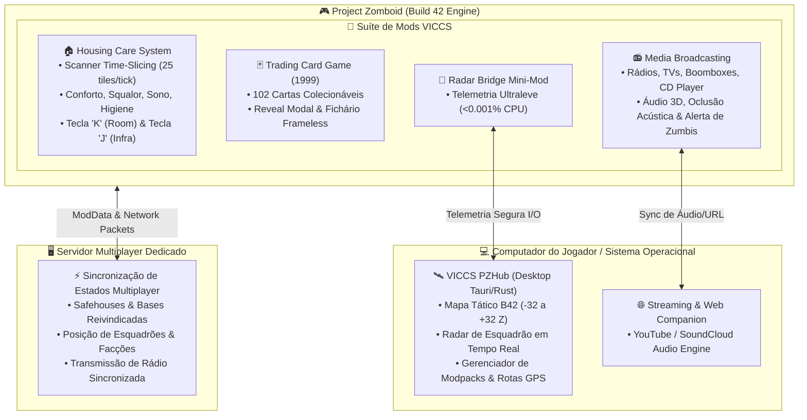
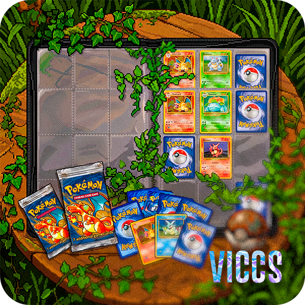
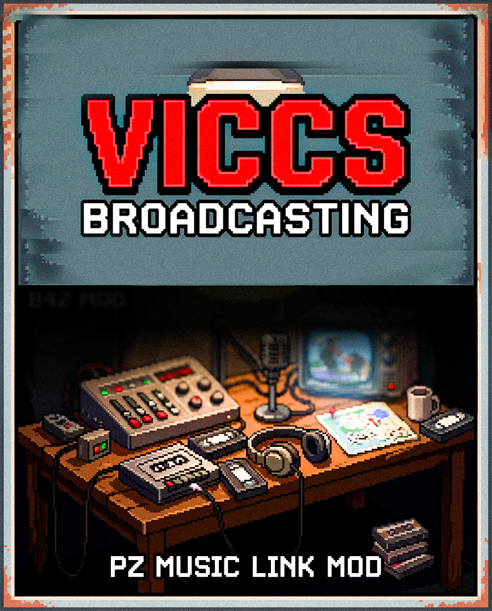

# 🧟‍♂️ VICCS — Project Zomboid Build 42 Mod Suite

[](https://projectzomboid.com/)
[](LICENSE)
[]()
[]()
[]()
[]()

---

> **Bem-vindo à suíte oficial de modificações e ferramentas VICCS para o Project Zomboid (Build 42).**  
> Nossa filosofia de engenharia é inegociável: **Imersão profunda, arquitetura não-invasiva, zero impacto no FPS e 100% de estabilidade multiplayer.**

---

## 📑 Índice Geral

1. [🏛️ O Ecossistema VICCS (Visão Geral)](#️-o-ecossistema-viccs-visão-geral)
2. [🗺️ Arquitetura Integrada da Suíte](#️-arquitetura-integrada-da-suíte)
3. [🏠 Módulo 1: VICCS Housing Care System (Living House)](#-módulo-1-viccs-housing-care-system-living-house)
   - [O que é e Como Funciona](#o-que-é-e-como-funciona-housing)
   - [Sistemas de Conforto & Insalubridade](#sistemas-de-conforto--insalubridade)
   - [Rotinas, Homemaking & Higiene](#rotinas-homemaking--higiene)
   - [📖 Mini Tutorial: Como Jogar](#-mini-tutorial-como-jogar-housing)
4. [🃏 Módulo 2: VICCS Trading Card Game (1999 Base Set)](#-módulo-2-viccs-trading-card-game-1999-base-set)
   - [O que é e Como Funciona](#o-que-é-e-como-funciona-tcg)
   - [Boosters, Raridades & Fichário 3D](#boosters-raridades--fichário-3d)
   - [📖 Mini Tutorial: Como Jogar](#-mini-tutorial-como-jogar-tcg)
5. [📻 Módulo 3: VICCS Media Broadcasting](#-módulo-3-viccs-media-broadcasting)
   - [O que é e Como Funciona](#o-que-é-e-como-funciona-broadcasting)
   - [Streaming Sincronizado & Áudio Espacial 3D](#streaming-sincronizado--áudio-espacial-3d)
   - [Acústica & Atração de Hordas](#acústica--atração-de-hordas)
   - [📖 Mini Tutorial: Como Jogar](#-mini-tutorial-como-jogar-broadcasting)
6. [🛰️ Módulo 4: VICCS PZHub (Desktop App & Squad Radar)](#️-módulo-4-viccs-pzhub-desktop-app--squad-radar)
   - [O que é e Como Funciona](#o-que-é-e-como-funciona-pzhub)
   - [Radar Tático ao Vivo & Suporte à B42 (-32 a +32 Z-Levels)](#radar-tático-ao-vivo--suporte-à-b42--32-a-32-z-levels)
   - [Central de Mods, GPS & Overlay](#central-de-mods-gps--overlay)
   - [📖 Mini Tutorial: Como Jogar](#-mini-tutorial-como-jogar-pzhub)
7. [🛠️ Guia do Administrador de Servidor](#️-guia-do-administrador-de-servidor)
   - [Configuração de server.ini](#configuração-de-serverini)
   - [Tabela Geral de Opções de Sandbox](#tabela-geral-de-opções-de-sandbox)
   - [Filosofia Zero-Lag (Time-Slicing & Amostragem)](#filosofia-zero-lag-time-slicing--amostragem)
8. [📦 Instalação & Setup Rápido](#-instalação--setup-rápido)
9. [🌐 Localização & Créditos](#-localização--créditos)

---

## 🏛️ O Ecossistema VICCS (Visão Geral)

A suíte VICCS reúne módulos independentes e altamente integrados projetados especificamente para a **Build 42 do Project Zomboid**. Você pode utilizar qualquer um dos módulos de forma isolada (standalone) ou usufruir da experiência completa em conjunto:

| Módulo / Projeto | ID do Mod | Versão | Tipo | Descrição Breve |
| :--- | :--- | :---: | :---: | :--- |
| **🏠 Housing Care System** | `VICCS_HousingCareSystem` | `v1.5.8` | Mod In-Game | Sistema orgânico de conforto, insalubridade, tarefas domésticas, sono reparador e rotinas para bases. |
| **🃏 Trading Card Game** | `VICCS_TCG` | `v1.0.1` | Mod In-Game | Coleção nostálgica de 102 cartas colecionáveis (Base Set 1999) com abertura animada e fichário de luxo. |
| **📻 Media Broadcasting** | `VICCS_Broadcasting` | `v1.2.0` | Mod In-Game | Plataforma de streaming de áudio/vídeo sincronizado (YouTube/SoundCloud) com áudio 3D e atração de hordas. |
| **🛰️ PZHub & Radar Bridge** | `VICCSRadarBridge` | `v1.0.0` | Desktop + Mod | Companion Desktop (Tauri/Rust) com mapa tático ao vivo, radar de esquadrão, rotas GPS e mod manager. |

---

## 🗺️ Arquitetura Integrada da Suíte



---

## 🏠 Módulo 1: VICCS Housing Care System (Living House)

> **ID do Mod:** `VICCS_HousingCareSystem`  
> **Versão:** `1.5.8` | **Compatibilidade:** Build 42.20+ (Singleplayer & Servidores Dedicados)


### O que é e Como Funciona (Housing)
Inspirado na dinâmica de conforto de *Valheim*, o **Housing Care System** transforma a base de uma simples garagem de loot em um **refúgio vital de regeneração psicológica e física**. 

O sistema avalia cada cômodo em tempo real calculando duas forças opostas:
1. **Conforto (0 a 100 pts):** Gerado por móveis de qualidade, iluminação ativa, variedade decorativa e carpintaria artesanal.
2. **Insalubridade / Squalor (0 a 100 pts):** Gerado por sangue seco no chão, cadáveres em decomposição, lixo acumulado e sanitários imundos.

> 🚨 **Regra de Precedência Crítica:** Se o nível de sujeira ultrapassar `Squalor >= 50`, **todos os benefícios de conforto são instantaneamente anulados**, independentemente de quão luxuosa for a mobília.

### Sistemas de Conforto & Insalubridade

| Nível | Conforto (Buffs) | Insalubridade (Debuffs) |
| :---: | :--- | :--- |
| **Tier 1 (20+ pts)** | 🌿 **Aconchego Básico:** -15% de ganho de pânico. | ⚠️ **Desagradável:** Ganho lento de infelicidade/tristeza. |
| **Tier 2 (40+ pts)** | ☕ **Lar Organizado:** Regeneração acelerada de estamina (*Energizado*). | 🪰 **Insalubre:** Acúmulo de estresse e cansaço físico contínuo. |
| **Tier 3 (60+ pts)** | 🛋️ **Refúgio Confortável:** Zera tristeza, cura rápida de cortes e arranhões. | 🤢 **Antro Imundo:** Náuseas frequentes, tontura e fadiga mental. |
| **Tier 4 (80+ pts)** | 🏰 **Santuário:** Imunidade a pânico leve, redução rápida de estresse e bônus imunológico. | ☠️ **Foco de Doença:** Febre severa e alto risco de infecção de feridas. |

### Rotinas, Homemaking & Higiene
- **Tarefas Domésticas (Homemaking):** Limpar sangue, cozinhar no fogão, cuidar de hortas ou barricar janelas estende o bônus de conforto em até **+8h adicionais** por dia.
- **Sono Reparador (Sleep Revitalize):** Dormir 6h+ em uma cama limpa com um **Travesseiro** (equipado, no inventário ou sobre a cama) zera 100% de tédio, estresse e tristeza ao acordar.
- **Higiene Bucal & Banheiro:** Escove os dentes em pias com pasta de dente para receber o buff *Hálito Fresco* (-15 estresse, -10 tédio por 4h). Alivie a bexiga no vaso sanitário para evitar penalidades de urgência.
- **Sazonalidade:** Lareiras e tapetes aquecem e dão conforto massivo no inverno; ventiladores e cortinas fechadas protegem no verão.

### 📖 Mini Tutorial: Como Jogar (Housing)
1. **Reivindique sua Base:** Clique com o botão direito no piso do seu abrigo e selecione *"Living House: Estabelecer Residência como Meu Lar"* (em servidores multiplayer, use a Safehouse oficial).
2. **Abra o Painel de Inspeção (`Tecla K`):** Veja a pontuação detalhada do cômodo, a categoria de cada móvel e o diagnóstico inteligente do que falta para subir de Tier.
3. **Limpe o Local:** Antes de mobiliar, remova cadáveres para longe e limpe o chão com pano, água e cândida.
4. **Decore com Sabedoria:** Combine camas, sofás, mesas, luzes e quadros. Lembre-se: colocar 10 cadeiras repetidas não funciona devido à curva de retornos decrescentes.
5. **Acompanhe a Infraestrutura (`Tecla J`):** Monitore o combustível dos geradores elétricos e o nível de água dos barris coletores de chuva sem precisar sair da casa.

---

## 🃏 Módulo 2: VICCS Trading Card Game (1999 Base Set)

> **ID do Mod:** `VICCS_TCG`  
> **Versão:** `1.0.1` | **Compatibilidade:** Build 42.0+ (Singleplayer & Multiplayer)



### O que é e Como Funciona (TCG)
O **VICCS TCG** transporta a lendária febre das cartas colecionáveis do final dos anos 90 para o apocalipse de Knox County. O mod adiciona todas as **102 cartas clássicas do Base Set de 1999**, permitindo ao sobrevivente encontrar pacotes selados, vivenciar a emoção de abri-los e catalogar sua coleção em um fichário de luxo.

### Boosters, Raridades & Fichário 3D
- **Distribuição de Pacotes:** Encontrados no loot de casas de família, cômodos infantis, armários escolares, bancas de revistas e lojas de brinquedos.
- **Sistema de Raridades Autêntico:** Cartas Comuns (●), Incomuns (◆), Raras (★) e as cobiçadas **Holofoils Brilhantes** (com chance de 33% por padrão ao tirar uma rara).
- **Fichário Interativo (Binder UI):** Interface Frameless Soft Glass com grade 3x3 (9 cartas por página), navegação fluida, contador de progresso (ex: `47/102 Coletadas - 46% Concluído`) e filtros.
- **Alívio Mental Real:** Descobrir cartas novas ou folhear o fichário durante noites chuvosas reduz intensamente o Tédio e a Depressão do seu personagem.

### 📖 Mini Tutorial: Como Jogar (TCG)
1. **Colete Pacotes de Cartas:** Durante suas expedições de loot, fique atento a mochilas escolares, mesas de centro e cômodos residenciais.
2. **Abra o Booster:** Clique com o botão direito no pacote de cartas no inventário e selecione *"Abrir Pacote de Cartas"*.
3. **Vire as Cartas (Reveal Modal):** Uma tela interativa se abrirá. Clique nas cartas viradas para baixo para revelar uma a uma e descobrir suas raridades.
4. **Organize seu Fichário:** Clique com o botão direito no item *Fichário de Cartas* e selecione *"Abrir Fichário"*. Arraste suas cartas do inventário para os slots do fichário.
5. **Inspecione com Zoom:** Dê um duplo clique em qualquer carta guardada no fichário para ver sua arte em alta resolução, ataques e detalhes nostálgicos.

---

## 📻 Módulo 3: VICCS Media Broadcasting

> **ID do Mod:** `VICCS_Broadcasting`  
> **Versão:** `1.2.0` | **Compatibilidade:** Build 42.0+ (Sincronização Multiplayer Dedicada)



### O que é e Como Funciona (Broadcasting)
O **VICCS Media Broadcasting** é uma solução completa de mídia e transmissão ao vivo no Project Zomboid. Ele permite que rádios, televisões, boomboxes e aparelhos de som portáteis toquem músicas e fluxos de áudio reais de fontes como **YouTube, YouTube Music e SoundCloud**, perfeitamente sincronizados entre todos os jogadores conectados.

### Streaming Sincronizado & Áudio Espacial 3D
- **Sincronia Global em Multiplayer:** Se você ligar uma música em um boombox na sua base, todos os membros do esquadrão presentes na sala escutarão o mesmo som, no mesmo segundo exato.
- **Motor de Áudio Espacial Posicional:** O áudio possui atenuação por distância, balanço estéreo dinâmico e oclusão acústica: se o rádio estiver no andar de baixo ou atrás de paredes grossas, o som ficará abafado de forma hiper-realista.
- **Dispositivos Suportados:** Televisores residenciais, rádios AM/FM comerciais, estações de som portáteis (Boomboxes) e CD Players portáteis de bolso.

### Acústica & Atração de Hordas
- **Risco Tático:** Som tem peso no apocalipse. Tocar músicas altas em caixas de som abertas atrairá zumbis em um raio de até **25 tiles** (ajustável no Sandbox).
- **Fones de Ouvido Silenciosos:** Ao equipar fones de ouvido no seu CD Player portátil, o áudio toca apenas para o seu personagem, zerando o ruído externo e mantendo você em segurança furtiva durante expedições.

### 📖 Mini Tutorial: Como Jogar (Broadcasting)
1. **Ligue o Aparelho:** Aproxime-se de uma TV, Rádio, Boombox ou equipe um CD Player. Certifique-se de que há energia elétrica (gerador ou baterias carregadas).
2. **Abra o Player:** Clique com o botão direito no aparelho e selecione *"Sintonizar / Abrir VICCS Media Player"*.
3. **Cole a Mídia:** Insira a URL ou link da música/playlist desejada (YouTube ou SoundCloud) e clique no botão Play.
4. **Controle o Volume:** Ajuste os controles deslizantes de volume na HUD translúcida.
5. **Use em Segurança:** Conecte fones de ouvido caso queira escutar suas faixas favoritas sem transformar sua casa em um ímã de hordas.

---

## 🛰️ Módulo 4: VICCS PZHub (Desktop App & Squad Radar)

> **ID do Mod:** `VICCSRadarBridge` (Mod In-Game) + `VICCS_PZHub` (Desktop Tauri Companion)  
> **Versão:** `1.0.0` | **Compatibilidade:** Build 42 (Suporte total Z-Levels -32 a +32) e Build 41


### O que é e Como Funciona (PZHub)
O **VICCS PZHub** é o centro de comando definitivo para o jogador moderno de Project Zomboid. Desenvolvido sobre **Tauri e Rust**, o aplicativo desktop atua em sintonia direta com o mini-mod `VICCSRadarBridge`, fornecendo telemetria em tempo real, visualização de mapa tático e sincronização de esquadrão sem interferir na estabilidade do jogo.

### Radar Tático ao Vivo & Suporte à B42 (-32 a +32 Z-Levels)
- **Mapeamento em Alta Resolução:** Mapa completo de Knox Country com projeção isométrica fiel ao jogo.
- **Escala Vertical Build 42:** Suporte nativo aos novos andares subterrâneos (-32) e arranha-céus (+32) introduzidos na Build 42, rastreando a elevação exata de cada membro da equipe.
- **Rastreamento de Esquadrão:** Visualize onde seus amigos estão, sua saúde, status de veículos e direção de movimento em tempo real.

### Central de Mods, GPS & Overlay
- **Navegador GPS Ponto a Ponto:** Trace rotas de comboio e navegação entre postos de gasolina, hospitais, safehouses e pontos de extração.
- **Modpack & Mod Scanner:** Identifique automaticamente mods locais instalados, verifique integridade e instale atualizações com um clique.
- **Picture-in-Picture & Overlay:** Posicione o radar tático como uma janela translúcida sobreposta ao jogo ou jogue com mapa dinâmico em um segundo monitor.

### 📖 Mini Tutorial: Como Jogar (PZHub)
1. **Inicie o App Desktop:** Abra o aplicativo `VICCS PZHub` no seu computador.
2. **Instalação do Mini-Mod:** No menu de configurações (⚙️) do PZHub, clique em *"Instalar Mod no Project Zomboid"* (ou copie a pasta `server-mod` para sua pasta de mods como `VICCSRadarBridge`).
3. **Ative no Jogo:** No menu de mods do Project Zomboid, marque `VICCS PZMap Live Squad Radar Bridge` como ATIVO.
4. **Crie ou Junte-se a um Esquadrão:** Na aba Social do PZHub, gere um código de esquadrão e envie para seus companheiros de equipe.
5. **Navegue com GPS:** Abra o mapa tático, visualize os blips do seu time em tempo real e trace rotas táticas com estimativa de trajeto.

---

## 🛠️ Guia do Administrador de Servidor

Projetado do zero para suportar servidores dedicados de alta densidade (20 a 100+ jogadores simultâneos) sem quedas de tickrate ou desyncs.

### Configuração de server.ini
Para ativar todos os módulos no seu servidor dedicado, adicione os IDs correspondentes na diretiva `Mods` do arquivo de configuração do seu servidor:

```ini
Mods=VICCS_HousingCareSystem;VICCS_TCG;VICCS_Broadcasting;VICCSRadarBridge;
```

### Tabela Geral de Opções de Sandbox

Todas as variáveis podem ser ajustadas em tempo real via menu de administração in-game ou pelo arquivo `server_SandboxVars.lua`:

| Módulo | Opção Sandbox | Padrão | Intervalo | Finalidade |
| :--- | :--- | :---: | :---: | :--- |
| **Housing** | `HousingCareSystem.SystemEnabled` | `true` | bool | Liga/desliga o cálculo de conforto e squalor. |
| **Housing** | `HousingCareSystem.RequireSafehouseClaim` | `true` | bool | Restringe bônus a Safehouses oficiais registradas. |
| **Housing** | `HousingCareSystem.SqualorOverrideThreshold` | `50` | 10 a 90 | Nível de sujeira que anula qualquer conforto. |
| **Housing** | `HousingCareSystem.AcclimatizationMinutes` | `30` | 0 a 120 | Tempo em minutos in-game para ativar os bônus. |
| **TCG** | `VICCS_TCG.SpawnRate` | `3` | 1 a 6 | Frequência de loot de pacotes de cartas pelo mapa. |
| **TCG** | `VICCS_TCG.HoloChancePercent` | `33` | 0 a 100 | Porcentagem de chance de vir carta Holo no slot raro. |
| **TCG** | `VICCS_TCG.PreFilledBinderChance` | `50` | 0 a 100 | Chance de fichários encontrados no loot já conterem cartas. |
| **Broadcasting** | `VICCS_Broadcasting.ZombieAttractionRadius` | `25` | 0 a 100 | Raio em tiles que o som da música alerta zumbis. |
| **Broadcasting** | `VICCS_Broadcasting.CDPlayerSilent` | `true` | bool | Garante que fones de ouvido não atraiam zumbis. |
| **Broadcasting** | `VICCS_Broadcasting.SpatialAudioEnabled` | `true` | bool | Ativa motor de áudio 3D e oclusão de paredes. |

### Filosofia Zero-Lag (Time-Slicing & Amostragem)
- **Varredura em Fatias de Tempo:** O scanner do *Housing Care System* processa rigorosamente apenas `25 tiles por tick`, eliminando picos de processamento na CPU.
- **Radar Bridge Ultraleve:** O módulo de radar do PZHub utiliza chamadas de I/O em intervalos de 500ms com impacto de CPU inferior a 0.001%.
- **Zero Monkey-Patching:** Nenhuma função fundamental do núcleo do Project Zomboid ou da máquina virtual Kahlua é sobrescrita, prevenindo qualquer incompatibilidade com outros mods da Steam Workshop.

---

## 📦 Instalação & Setup Rápido

### 👤 Singleplayer & Co-op Local
1. Extraia ou copie as pastas dos módulos desejados para o seu diretório de mods:  
   `C:\Users\<SeuUsuario>\Zomboid\mods\`
2. Inicie o **Project Zomboid**, clique em **MODS** no menu principal e marque como **ATIVOS** os módulos que deseja jogar.
3. Crie um novo mundo ou continue seu save atual com tranquilidade.

### 🖥️ Servidores Dedicados
1. Faça o upload das pastas dos mods para o diretório de mods do servidor.
2. Adicione os IDs correspondentes à linha `Mods=` no arquivo `<NomeDoServidor>.ini`.
3. Inicie o servidor. Os arquivos de Sandbox serão injetados automaticamente.

> [!TIP]
> **Compatibilidade Mid-Save:** Todos os mods da suíte VICCS são 100% seguros para serem adicionados ou removidos no meio de uma campanha sem corromper mundos salvos.

---

## 🌐 Localização & Créditos

A suíte possui localização completa (interfaces, halos de notificação, moodlets e sandboxes) para **5 idiomas globais**:

* 🇧🇷 **Português (Brasil)** — Nativo
* 🇺🇸 **Inglês (English)** — Nativo
* 🇪🇸 **Espanhol (Español)** — Nativo
* 🇨🇳 **Chinês Simplificado (简体中文)** — Nativo
* 🇹🇼 **Chinês Tradicional (繁體中文)** — Nativo

---

<div align="center">
  <sub>Desenvolvido com excelência técnica por <b>VICCS</b> para a comunidade mundial de Project Zomboid.</sub>  
  <br>
  <sub>Suíte VICCS Build 42 — Documento Mestre de Engenharia & Design</sub>
</div>
